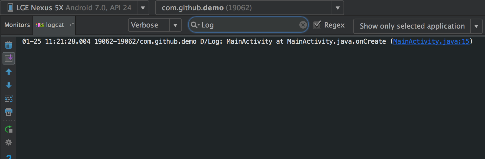

[](https://jitpack.io/#deskid/logutils)

### feature
- auto logging the method name and line number when you log, and you can lookup the source code with a click on Android studio logcat.
- work around BuildConfig.DEBUG always return false in released library projects. [see here](https://code.google.com/p/android/issues/detail?id=52962). auto disable log in production.

### how to use

1. in root `build.gradle`

    ```
    allprojects {
    		repositories {
    			...
    			maven { url 'https://jitpack.io' }
    		}
    	}
    ```
2. in your module, add

    ```
    dependencies {
    	        compile 'com.github.deskid:logutils:v1.0.0'
    	}
    ``` 

3. init the context when application create


    ```java
    public class App extends Application {
        @Override
        public void onCreate() {
            super.onCreate();
            DebugUtils.setApplicationContext(this);
        }
    }
    ```
    
4. done.
    
    ```java
    LogUtils.d("this is a log");//auto tagged: Log
    LogUtils.d("TAG","this is a log");
    ```




